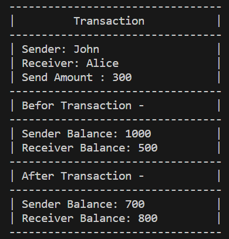

# Transaction System

This simple Python program demonstrates a basic transaction system. It consists of two classes: `Transaction` and `Amount`. The `Transaction` class is used to initiate and display transactions, while the `Amount` class represents an account with a name and balance.

## Usage

1. Create sender and recipient accounts:

    ```python
    sender = Amount("John", 1000)
    recipient = Amount("Alice", 500)
    ```

2. Initialize a transaction:

    ```python
    transaction = Transaction(sender, recipient, 300)
    ```

3. Execute the transaction:

    ```python
    transaction.send()
    ```

4. Display transaction details:

    ```python
    transaction.display()
    ```

5. Code

    ``` Python []
    class Transaction:
        def __init__(self, sender, receiver, amount):
            self.sender = sender
            self.receiver = receiver
            self.amount = amount

        def send(self):
            self.sender.balance -= self.amount
            self.receiver.balance += self.amount

        def display(self):
            print("---------------------------------")
            print("|         Transaction           |")
            print("---------------------------------")
            print(f"| Sender: {self.sender.name}\t\t\t|")
            print(f"| Receiver: {self.receiver.name}\t\t|")
            print(f"| Send Amount : {self.amount}\t\t|")
            print("---------------------------------")
            print(f"| Befor Transaction -           |")
            print("---------------------------------")
            print(f"| Sender Balance: {self.sender.balance + self.amount}\t\t|")
            print(f"| Receiver Balance: {self.receiver.balance - self.amount}\t\t|")
            print("---------------------------------")
            print(f"| After Transaction -           |")
            print("---------------------------------")
            print(f"| Sender Balance: {self.sender.balance}\t\t|")
            print(f"| Receiver Balance: {self.receiver.balance}\t\t|")
            print("---------------------------------")

    class Amount:
        def __init__(self, name, balance):
            self.name = name
            self.balance = balance

        
    sender = Amount("John", 1000)
    recipient  = Amount("Alice", 500)

    transaction = Transaction(sender, recipient, 300)
    transaction.send()
    transaction.display()
    ```
## Transaction Details

The `display` method in the `Transaction` class provides detailed information about the transaction, including sender and recipient names, the amount sent, and balances before and after the transaction.

Example output:

Here is the output of the transaction:



